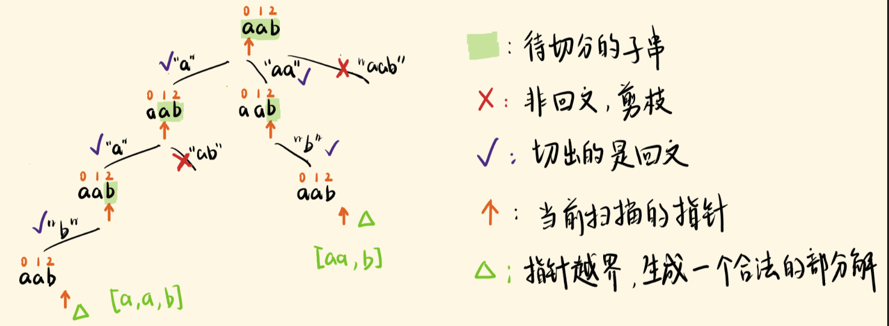

思路
题意问的是，切分字符串s，切出的每一个子串必须是回文串，请找出所有切分的可能。

我们用指针 start 试着去切，切出一个回文串，基于新的 start，继续往下切，直到 start 越界

每次基于当前的 start，可以选择不同的 i，切出 start 到 i 的子串，我们枚举出这些选项 i：

切出的子串满足回文，将它加入部分解 temp 数组，并继续往下切（递归）
切出的子串不是回文，跳过该选择，不落入递归，继续下一轮迭代

为什么要回溯
因为不是找到一个合法的部分解就完事，要找齐所有的合法的部分解。

下面两种情况，是结束当前递归的两种情形：

指针越界了，没有可以切分的子串了，递归到这一步，说明一直在切出回文串，现在生成了一个合法的部分解，return
走完了当前递归的 for 循环，考察了基于当前 start 的所有的切分可能，当前递归自然地结束
它们都代表，当前作出的选择，所进入的递归，结束了，该分支的搜索结束了，该去搜另一分支了

所以当前递归结束后，要将当前的选择撤销，回到选择前的状态，去考察另一个选择，即进入下一轮迭代，尝试另一种切分的可能。

这样才能在解的空间树中，把路走全了，搜出所有的合法部分解。
