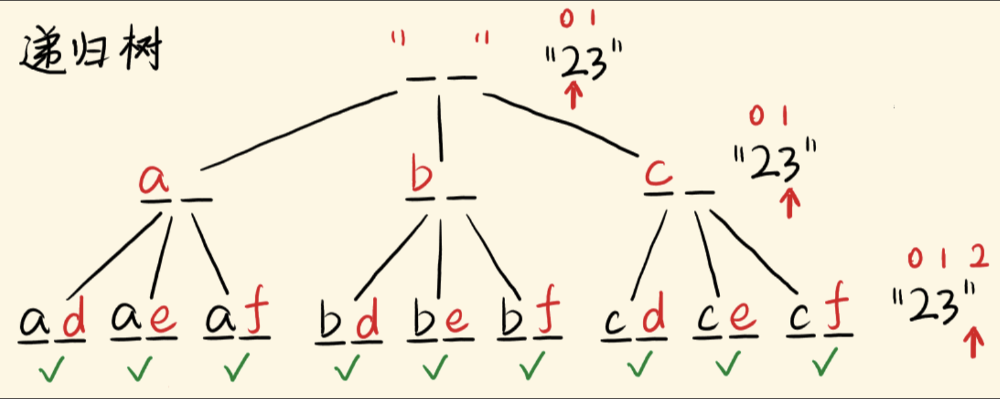

思路
其实就是将数字串“翻译”成字母串，找出所有的翻译可能。
翻译第一个数字有 3 / 4 种选择，翻译第二个数字又有 3 / 4 种选择……
从首位翻译到末位，会展开成一棵递归树。指针 i 是当前考察的字符的索引。
当指针越界时，此时生成了一个解，加入解集，结束当前递归，去别的分支，找齐所有的解。




```ts
const letterCombinations = (digits) => {
  if (digits.length == 0) return [];
  const res = [];
  const map = { '2': 'abc', '3': 'def', '4': 'ghi', '5': 'jkl', '6': 'mno', '7': 'pqrs', '8': 'tuv', '9': 'wxyz' };
  // dfs: 当前构建的字符串为curStr，现在“翻译”到第i个数字，基于此继续“翻译”
  const dfs = (curStr, i) => {   // curStr是当前字符串，i是扫描的指针
    if (i > digits.length - 1) { // 指针越界，递归的出口
      res.push(curStr);          // 将解推入res
      return;                    // 结束当前递归分支
    }
    const letters = map[digits[i]]; // 当前数字对应的字母
    for (const letter of letters) { // 一个字母是一个选择，对应一个递归分支
      dfs(curStr + letter, i + 1);  // 选择翻译成letter，生成新字符串，i指针右移继续翻译（递归）
    }
  };
  dfs('', 0); // 递归的入口，初始字符串为''，从下标0开始翻译
  return res;
};
```