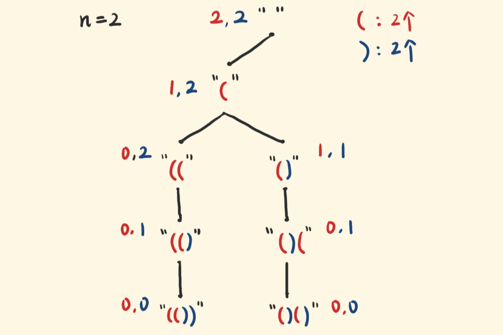

思路
就是不停选括号，要么选左括号，要么选右括号。

并有这些约束的：

只要(有剩，就可以选(。 (((((这么选，都还不能判定为非法。
当剩下的)比(多时，才可以选)，否则，)不能选，选了就非法。
因为：剩下的)比(少，即，使用的)比(多，不能成双成对。
描述节点的状态有：当前构建的字符串，和左右括号所剩的数量。



回溯算法，死抓三点
选择
在这里，每次最多两个选择，选左括号或右括号，“选择”会展开出一棵解的空间树。
用 DFS 遍历这棵树，找出所有的解，这个过程叫回溯。
约束条件
即，什么情况下可以选左括号，什么情况下可以选右括号。
利用约束做“剪枝”，即，去掉不会产生解的选项，即，剪去不会通往合法解的分支。
比如()，现在左右括号各剩一个，再选)就成了())，不能让这个错的选择成为选项（不落入递归）：

```ts
if (right > left) { // 右括号剩的比较多，才能选右括号
    dfs(str + ')', left, right - 1);
}
```

目标
构建出一个用尽 n 对括号的合法括号串。
意味着，当构建的长度达到 2*n，就可以结束递归（不用继续选了）。

充分剪枝的好处
经过充分剪枝，所有不会通往合法解的选项都被剪掉，只要往下递归，就都通向合法解。
即只要递归到：当构建的字符串的长度为 2*n 时，一个合法解就生成了，放心地加入解集。


```ts
var generateParenthesis = function (n) {
  const res = [];

  const dfs = (lRemain, rRemain, str) => { // 左右括号所剩的数量，str是当前构建的字符串
    if (str.length == 2 * n) { // 字符串构建完成
      res.push(str);           // 加入解集
      return;                  // 结束当前递归分支
    }
    if (lRemain > 0) {         // 只要左括号有剩，就可以选它，然后继续做选择（递归）
      dfs(lRemain - 1, rRemain, str + "(");
    }
    if (lRemain < rRemain) {   // 右括号比左括号剩的多，才能选右括号
      dfs(lRemain, rRemain - 1, str + ")"); // 然后继续做选择（递归）
    }
  };

  dfs(n, n, ""); // 递归的入口，剩余数量都是n，初始字符串是空串
  return res;
};
```