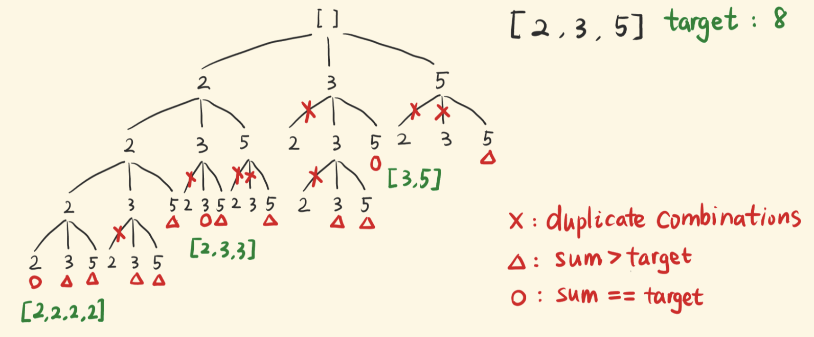

在回溯算法的递归树中，算法总是深度优先，一条路径走到底，然后回溯到上一个决策点，再尝试另一条路径。

回溯：在包含问题所有解的空间树中，用DFS的方式，从根节点出发，搜索整棵解空间树。

搜索至任何一个节点时，总是会先判断当前节点是否可以通往最后的合法解。如果不可以，则结束对「以当前节点为根节点的子树」的搜索，向父节点回溯，回到之前的状态，搜索下一个分支。

否则，进入该子树，继续以DFS的方式搜索。

空间树中的节点是动态的，即，当前有哪些选项可选择，是根据上一步的选择得出的，所以做回溯时，要把状态还原成进入当前节点之前的状态。

确定出问题的解空间树，它是隐式的，不是显式的一棵树。不熟练的就画图看看。

然后，明确每个节点的扩展搜索规则。

然后进行DFS搜索，并注意剪枝，避免无效的搜索。

