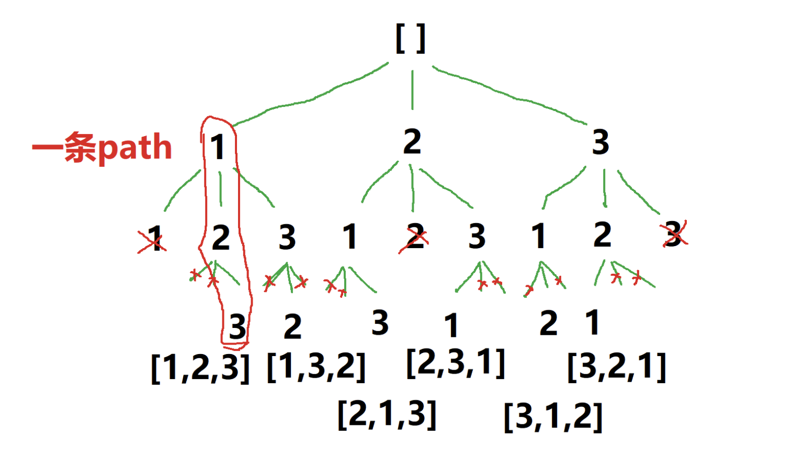

### 思路
每一位都有3种选择：1、2、3。

每一次都做选择，展开出一棵空间树，如下图。

利用约束条件「不能重复选」，做剪枝，剪去不会产生正确解的选项（分支）。

利用 hashMap，记录选过的数，下次遇到相同的数，跳过。
这样就不会进入「不会得出解的分支」，不做无效的搜索。




### 怎么写递归函数
我们要在这个包含解的空间树上，用 DFS 的方式搜索出所有的解。

dfs 函数：基于当前的 path，继续选数，直到构建出合法的 path，加入解集。

递归的入口：dfs 执行传入空 path，什么都还没选。

函数体内，用 for loop 枚举出当前所有的选项，并用 if 语句跳过剪枝项。

每一轮迭代，作出一个选择，基于它，继续选（递归调用）。
递归的出口：当构建的 path 数组长度等于 nums 长度，就选够了，加入解集。

### 为什么要回溯
我们不是找到一个排列就完事，要找出所有满足条件的排列。

当一个递归调用结束，结束的是当前的递归分支，还要去别的分支继续搜。

所以，要撤销当前的选择，回到选择前的状态，再选下一个选项，即进入下一个分支。

注意，往 map 存入的当前选择也要撤销，表示撤销这个选择。

退回来，把路走全，才能在一棵空间树中，回溯出所有的解。


### 为什么加入解集时，要将数组内容拷贝到一个新的数组里，再加入解集？

因为该 path 变量存的是地址引用，结束当前递归时，将它加入 res 后，该算法还要进入别的递归分支继续搜索，还要继续将这个 path 传给别的递归调用，它所指向的内存空间还要继续被操作，所以 res 中的 path 的内容会被改变，这就不对。
所以要弄一份当前的拷贝，放入 res，这样后续对 path 的操作，就不会影响已经放入 res 的内容。


```ts
const permute = (nums) => {
    const res = [];
    const used = {};

    function dfs(path) {
        if (path.length == nums.length) { // 个数选够了
            res.push(path.slice()); // 拷贝一份path，加入解集res
            return;                 // 结束当前递归分支
        }
        for (const num of nums) { // for枚举出每个可选的选项
            // if (path.includes(num)) continue; // 别这么写！查找是O(n)，增加时间复杂度
            if (used[num]) continue; // 使用过的，跳过
            path.push(num);         // 选择当前的数，加入path
            used[num] = true;       // 记录一下 使用了
            dfs(path);              // 基于选了当前的数，递归
            path.pop();             // 上一句的递归结束，回溯，将最后选的数pop出来
            used[num] = false;      // 撤销这个记录
        }
    }

    dfs([]); // 递归的入口，空path传进去
    return res;
};
```