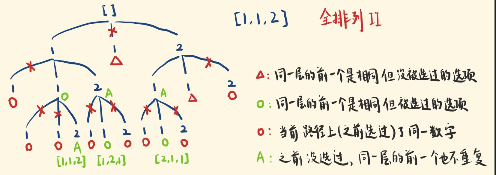

思路

这道题容易含糊的是约束条件!

一个数字不能重复地被选。

不能产生重复的排列。重复的排列是怎么产生的？

比如[1,1,2]，先选第一个 1，和先选第二个 1，往后的情况是一样的。
即，“同一层” 的选项出现重复，或者说，当前可选的选项出现重复。

重复的选项要修剪掉，为了方便在迭代中识别出重复，先对 nums 中数字升序排序，使得相同的数字相邻。

充分地剪枝
对应上面第一点，我们使用一个 used 数组记录使用过的数字，使用过了就不再使用：

if (used[i]) {
continue;
}

对应上面第二点，如果当前的选项 nums[i]，与同一层的前一个选项 nums[i-1]相同，且 nums[i-1]存在，且没有被使用过，则忽略选项 nums[i]。
如果 nums[i-1]被使用过，它会被第一条修剪掉，不是选项了，即便它和 nums[i]重复，nums[i]还是可以选的。

if (i - 1 >= 0 && nums[i - 1] == nums[i] && !used[i - 1]) {
continue;
}

比如[1,1,2]，第一次选了第一个 1，第二次是可以选第二个 1 的，虽然它和前一个 1 相同。
因为前一个 1 被选过了，它在本轮已经被第一条规则修掉了，所以第二轮中第二个 1 是可选的。
